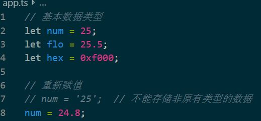

# 02 基本数据类型+报错分析

## 1.基本数据类型

```typescript
// ts原型
let num2 = 28;	// 等同于 let num2：number = 28;

// boolean
let isLogin:boolean = false;
// isLogin = 1;   // 报错

// string
let str:string = 'Hello Salen';

// any
let anything:any = 28;
anything = 'Hello';
```


## 2.不能存储非原有类型的数据




